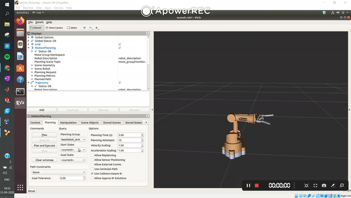

# Beetle-Bot-Arm
BeetleBot is aimed to be an open source learning and tinkering platform for anyone interested in control of Robotic Manipulators and Computer Vision. Currently the project is under initial development and configurations. 

# About
Beetlebot is a 5-DoF robotic manipulator designed in Solidworks. Currently the arm is capable of basic manipulation and path motions. The robotic arm can either be printed using the provided .STL files and assembled with addition to some hardware and an Arduino board. Otherwise, it can be simulated in Rviz/Gazebo environment. For anyone looking to assemble the robot please find the list of required parts below:

* 3D printable Parts provided in the Repository
* Arduino Mega/Uno Board (Prefer Mega)
* MG996R Servo x2 - For base and end effector bracket (continous rotation/unlocked servo)
* MG995 Servo x2 - For both arms 
* SG90 Servo x2 - For Gripper Attachment
* OV7670 Camera Module
* DC to DC Step down Buck Converter (LM2596)
* 16 Channel 12 Bit Servo Driver Board (PCA9685)
* 12V DC Power Source
* Ball Bearings x2 (8x22x7 MM)
* Screws and Nuts
* Jumper Cables

Note: All these parts are easily available on Amazon/Other Retailers

# Installation
This part assumes that you are running Ubuntu 18.04 and have the following dependencies installed:
* ROS Melodic
* Rviz
* MoveIt
* Gazebo
* Rosserial
* OpenCV

Setup your environment
```shell
$ mkdir -p ~/beetlebot_setup/src
$ cd ~/beetlebot_setup/src
```
Clone this repository
```console
$ git clone https://github.com/Kartik-Singhal26/Beetlebot-Arm
$ catkin_make
$ cd ~/beetlebot_setup
$ source devel/setup.bash
```
# Task 1: Motion Planning in Simulation
For simulation purposes, plan and execute motion with Rviz. Use the following command to run Rviz Simulation:
```console
$ roslaunch beetlebot_moveit_config demo.launch
```
Now, select a planner of your choice from the OMPL dropdown menu. In the Planning subgroup allow for Use Collision-Aware IK.
Select the goal state for the robot from under the Query Menu. Since, Gripper and the rest of the arm are separate planning groups, select the beetlebot_arm group to move the manipulator. Select random valid or predifned poses from the drop down menu. Alternatively use the marker to move the robot. 

To run Gazebo Simulation:
```console
$ roslaunch beetlebot_moveit_config gazebo.launch
```



# Task 2: Teleoperation from Host Computer
Note: I am currently working on Ubuntu 18.04 running on VirtualMachine with a Windows Host. For this task check all possible permissions and connections with the arduino board and see there are no conflicting softwares running.

Secondly, Make sure your PCA9685 driver is hooked-up correctly with the Arduino Board.
Check this out: https://learn.adafruit.com/16-channel-pwm-servo-driver/hooking-it-up

Next, To communicate with the driver and ROS we need to setup a ros node for i2c communication. For this install:
* libi2c-de
* ros-i2cpwmboard 

Follow the following commands:
```console
$ sudo apt-get install libi2c-de
$ mkdir -p catkin_ws/src
$ cd ~/catkin_ws/src
$ git clone https://gitlab.com/bradanlane/ros-i2cpwmboard.git
$ cd ..
$ catkin_make
$ source devel/setup.bash
```
Make the following changes to the package files:
* Navigate to the CMakeLists.txt file in catkin_ws/src/ros-i2cpwmboard folder and add i2c to line 22
The line should look like: target_link_libraries(12cpwm_board ${catkin_LIBRARIES} i2c)

* Include the following code with the headers in the file i2cpwm_controller.cpp in catkin_ws/src/ros-i2cpwmboard_src folder:

extern "C"{
#include <i2c/smbus.h>
}

Save and Close both the files and open a new terminal.
```console
$ cd ~/catkin_ws
$ source devel/setup.bash
$ roscore
```
Open another Terminal at ~/catkin_ws, this will be the i2c communication node.
```console
$ rosrun i2cpwm_board i2cpwm_board 
```
# Project Status
## Tasks 
* Added: Gripper
* Solved: Orientation mismatch between Solidworks and Rviz/Gazebo
* Created: Moveit Package
* Created: URDF File
* Completed: Design and Assembly in Solidworks

## Current Known Issues
* Unable to communicate with the driver sometimes. Even though Arduino IDE is able to scan the I2C at 0x40. 

Error: 
```console
$ Failed to open I2C bus /dev/i2c-1
$ Failed to acquire bus access and./or talk to I2C slave at address 0x40
```
Tried: 
```console
$ sudo i2cdetect -y 0
```
No connection shown

## Planned Tasks
* Blob Detection with OpenCV
* Motion Planning with the real robot


